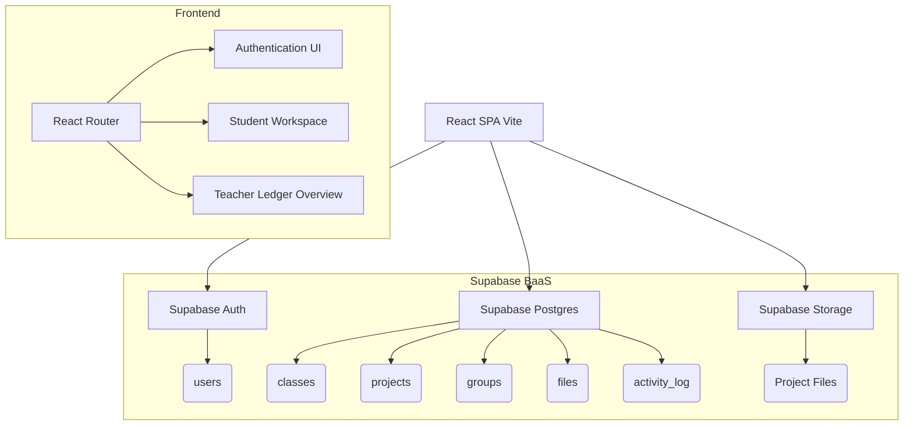

# ClassVault Architecture Diagram & Description

## Description
- **Frontend**: A React SPA built with Vite. UI state is managed mostly within components using React hooks. Routing is handled by `react-router-dom`.
- **Backend (BaaS)**: Supabase acts as the sole backend, utilizing PostgreSQL for relational data mapping (classes, groups, users) and Supabase Storage for project files.
- **Security**: Authentication is handled directly via Supabase Auth. Authorization is enforced via Row Level Security (RLS) on the Postgres tables (ensuring students can only access their group's files).
